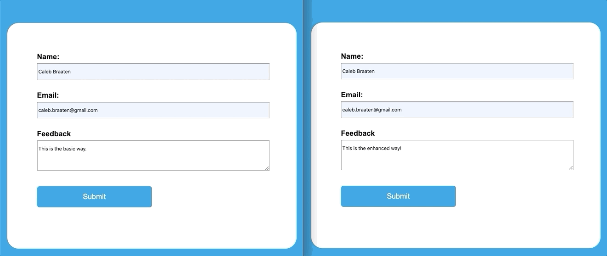

A Utility web component to send form data to a callback function instead of HTTP endpoint

# spa-form
 
spa-form is a utility component that progressively enhances html forms from a Multi-Page App to a Single-Page App
 

 
**Left Side:**
The *base behavior* where the HTML form uses its native behavior of sending the data to an endpoint and getting a response. The animation is showing a new page being loaded.
 
**Right Side:**
The *enhanced behavior* where the HTML form instead passes the form data to a defined callback function as an object of key value pairs. The animation is showing the form data being passed to a developer defined callback function that activates the modal.
 
 
## Installation
 
```
npm install spa-form
```
 
## Usage
### Overview
Use as a normal form element and add the attribute `is="spa-form"`
```html
<form is="spa-form" data-callback="myCallbackFunction" action="/endpoint" >
```
Include a script tag that defines the component for the browser. If JS is not available then the form will continue working as normal and not be progressively enhanced into an SPA
```html
<script src="./spa-form.js"></script>
```
 
### API (Attributes)
 
| Attribute | Description |
| --------- | :---------- |
| Inherited Attributes | Everything that the form element has: [MDN Docs](https://developer.mozilla.org/en-US/docs/Web/HTML/Element/form)
| `data-callback` | The function name, located in the global scope, that should be called on form submit. It will receive the form fields as a JS Object where the name attributes are the key. |
| `retainOnSubmit` | Add as an attribute to stop the form from resetting to default values when submitted. |
 
 
## Demo
To try the demo file yourself and explore the API do the following steps.
1. Clone the Repo
2. Open the demo.html file in your browser. No web server needed!
 
## Contributing
Feedback and pull requests are welcome! Please open issues so we can discuss any feature ideas or bugs found.
 
## License
[MIT](https://choosealicense.com/licenses/mit/)